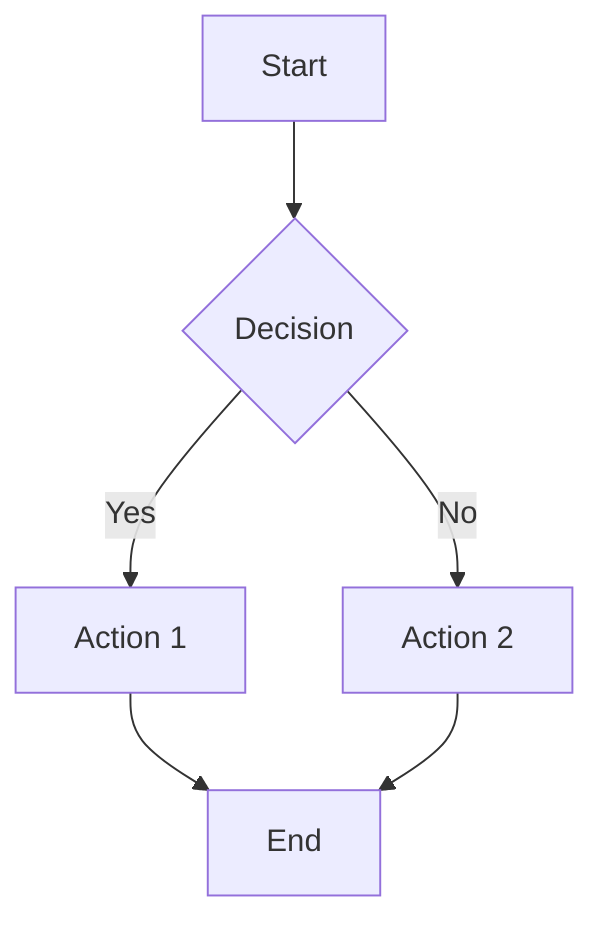
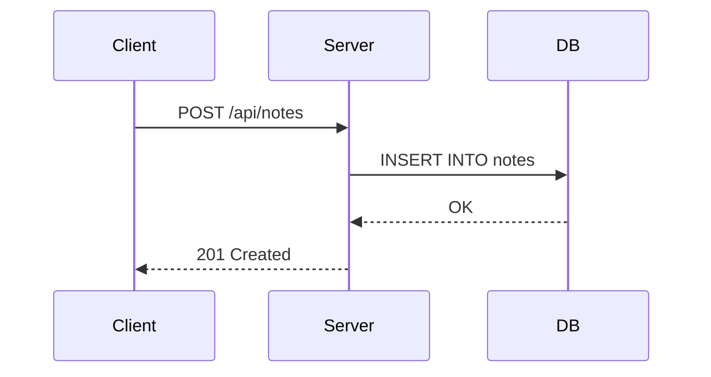
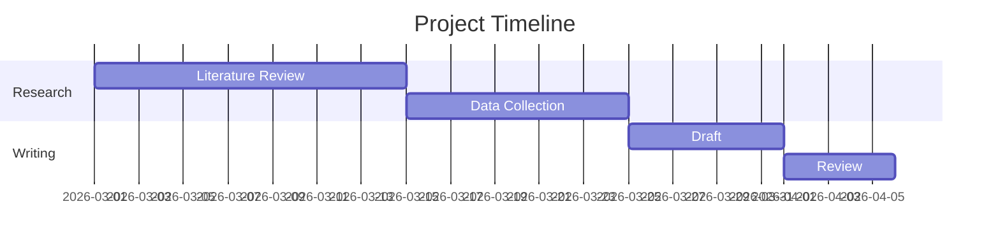

# Writing Guide

This guide covers all the writing features available in Research Note. Use it as a reference when writing your notes.

---

## 1. Basic Text Formatting

### Headings

Use `#` symbols to create headings. Up to 6 levels are supported.

```markdown
# Heading 1
## Heading 2
### Heading 3
#### Heading 4
##### Heading 5
###### Heading 6
```

### Emphasis

```markdown
**Bold text**
*Italic text*
***Bold and italic***
~~Strikethrough~~
```

**Bold text**, *Italic text*, ***Bold and italic***, ~~Strikethrough~~

### Blockquotes

```markdown
> This is a blockquote.
> It can span multiple lines.
>
> > Nested blockquotes are also supported.
```

> This is a blockquote.
> It can span multiple lines.
>
> > Nested blockquotes are also supported.

### Horizontal Rules

Use three or more dashes to create a horizontal rule:

```markdown
---
```

---

## 2. Lists

### Unordered List

```markdown
- Item 1
- Item 2
  - Nested item
  - Another nested item
- Item 3
```

- Item 1
- Item 2
  - Nested item
  - Another nested item
- Item 3

### Ordered List

```markdown
1. First item
2. Second item
3. Third item
   1. Sub-item
   2. Sub-item
```

1. First item
2. Second item
3. Third item
   1. Sub-item
   2. Sub-item

### Task List (Checklist)

```markdown
- [ ] Unchecked task
- [x] Completed task
- [ ] Another pending task
```

- [ ] Unchecked task
- [x] Completed task
- [ ] Another pending task

---

## 3. Code Blocks

### Inline Code

Wrap text with backticks for inline code:

```markdown
Use `console.log()` to print output.
```

Use `console.log()` to print output.

### Fenced Code Blocks

Use triple backticks with a language identifier for syntax-highlighted code blocks. Specify the language right after the opening backticks.

````markdown
```javascript
function greet(name) {
  return `Hello, ${name}!`;
}
```
````

```javascript
function greet(name) {
  return `Hello, ${name}!`;
}
```

### Supported Languages

You can use any language identifier recognized by the renderer. Here are commonly used ones:

| Language | Identifier |
|---|---|
| JavaScript | `javascript` or `js` |
| TypeScript | `typescript` or `ts` |
| Python | `python` or `py` |
| Rust | `rust` or `rs` |
| Go | `go` |
| Java | `java` |
| C | `c` |
| C++ | `cpp` or `c++` |
| C# | `csharp` or `cs` |
| Ruby | `ruby` or `rb` |
| PHP | `php` |
| Swift | `swift` |
| Kotlin | `kotlin` or `kt` |
| Scala | `scala` |
| R | `r` |
| Shell / Bash | `bash` or `sh` or `shell` |
| PowerShell | `powershell` or `ps1` |
| SQL | `sql` |
| HTML | `html` |
| CSS | `css` |
| SCSS | `scss` |
| JSON | `json` |
| YAML | `yaml` or `yml` |
| TOML | `toml` |
| XML | `xml` |
| Markdown | `markdown` or `md` |
| LaTeX | `latex` or `tex` |
| Docker | `dockerfile` |
| Lua | `lua` |
| Elixir | `elixir` |
| Haskell | `haskell` or `hs` |
| Dart | `dart` |

### Code Block Examples

**Python:**

```python
import numpy as np

def calculate_mean(data: list[float]) -> float:
    """Calculate the arithmetic mean of a list of numbers."""
    return np.mean(data)

results = calculate_mean([1.5, 2.3, 4.7, 3.1])
print(f"Mean: {results:.2f}")
```

**TypeScript:**

```typescript
interface User {
  id: number;
  name: string;
  email: string;
}

async function fetchUser(id: number): Promise<User> {
  const response = await fetch(`/api/users/${id}`);
  return response.json();
}
```

**SQL:**

```sql
SELECT
  u.name,
  COUNT(n.id) AS note_count,
  MAX(n.updated_at) AS last_updated
FROM users u
LEFT JOIN notes n ON u.id = n.user_id
GROUP BY u.name
ORDER BY note_count DESC;
```

**Bash:**

```bash
#!/bin/bash
for file in notes/*.md; do
  echo "Processing: $file"
  wc -w "$file"
done
```

---

## 4. Tables

Use pipes `|` and dashes `-` to create tables. Colons `:` control alignment.

```markdown
| Left Aligned | Center Aligned | Right Aligned |
|:-------------|:--------------:|--------------:|
| Row 1        | Data           |          100  |
| Row 2        | Data           |          200  |
| Row 3        | Data           |          300  |
```

| Left Aligned | Center Aligned | Right Aligned |
|:-------------|:--------------:|--------------:|
| Row 1        | Data           |          100  |
| Row 2        | Data           |          200  |
| Row 3        | Data           |          300  |

---

## 5. Math Equations (KaTeX)

### Inline Math

Wrap LaTeX expressions with single dollar signs `$...$`:

```markdown
The quadratic formula is $x = \frac{-b \pm \sqrt{b^2 - 4ac}}{2a}$.
```

The quadratic formula is $x = \frac{-b \pm \sqrt{b^2 - 4ac}}{2a}$.

### Block Math

Use double dollar signs `$$...$$` for display-mode equations:

```markdown
$$
\int_{-\infty}^{\infty} e^{-x^2} dx = \sqrt{\pi}
$$
```

$$
\int_{-\infty}^{\infty} e^{-x^2} dx = \sqrt{\pi}
$$

### Common Math Expressions

```markdown
- Fractions: $\frac{a}{b}$
- Subscript: $x_i$, Superscript: $x^2$
- Square root: $\sqrt{x}$, Nth root: $\sqrt[n]{x}$
- Summation: $\sum_{i=1}^{n} x_i$
- Product: $\prod_{i=1}^{n} x_i$
- Matrix:
$$
\begin{pmatrix}
a & b \\
c & d
\end{pmatrix}
$$
- Greek letters: $\alpha, \beta, \gamma, \delta, \epsilon, \theta, \lambda, \mu, \sigma, \omega$
- Operators: $\leq, \geq, \neq, \approx, \infty, \partial$
```

- Fractions: $\frac{a}{b}$
- Subscript: $x_i$, Superscript: $x^2$
- Square root: $\sqrt{x}$, Nth root: $\sqrt[n]{x}$
- Summation: $\sum_{i=1}^{n} x_i$
- Product: $\prod_{i=1}^{n} x_i$
- Matrix:

$$
\begin{pmatrix}
a & b \\
c & d
\end{pmatrix}
$$

- Greek letters: $\alpha, \beta, \gamma, \delta, \epsilon, \theta, \lambda, \mu, \sigma, \omega$
- Operators: $\leq, \geq, \neq, \approx, \infty, \partial$

---

## 6. Diagrams (Mermaid)

Use fenced code blocks with `mermaid` as the language identifier.

### Flowchart

````markdown

````


### Sequence Diagram

````markdown

````


### Gantt Chart

````markdown

````


### Other Diagram Types

Mermaid also supports: class diagrams, state diagrams, ER diagrams, pie charts, git graphs, and more. See [Mermaid documentation](https://mermaid.js.org/) for full syntax.

---

## 7. Wiki-Links

Connect your notes with bidirectional links using double brackets.

### Basic Link

```markdown
See [[Another Note]] for more details.
```

This creates a link to the note with the title "Another Note" and automatically creates a backlink from that note back to this one.

### Link with Display Text

```markdown
Check the [[research-paper|original research paper]] for the methodology.
```

This links to the note "research-paper" but displays "original research paper" as the link text.

### Section-Level Link

Link directly to a specific heading within a note using the `#` symbol:

```markdown
See [[Another Note#Methods]] for the experimental setup.
```

This navigates to the "Methods" heading inside the "Another Note" page. The heading is matched case-insensitively and special characters are ignored.

### Section Link with Display Text

Combine section targeting with custom display text:

```markdown
Read about [[quantum-mechanics#Entanglement|quantum entanglement]] for context.
```

This links to the "Entanglement" heading in the "quantum-mechanics" note, displaying "quantum entanglement" as the link text.

### How Backlinks Work

When you link from Note A to Note B using `[[Note B]]` or `[[Note B#heading]]`, a backlink automatically appears in Note B's backlinks section, showing that Note A references it. This creates a knowledge graph of interconnected notes. Section-level links are tracked at the note level — the backlink shows the source note regardless of the target section.

---

## 8. Images & File Attachments

### Image Syntax

```markdown

```

### Drag & Drop

Simply drag an image file from your file system and drop it into the editor. The image will be automatically uploaded and the markdown will be inserted at the drop position.

### Clipboard Paste

Copy an image to your clipboard and paste it (Ctrl+V / Cmd+V) in the editor. Screenshots work too.

### Supported Image Formats

PNG, JPEG, GIF, SVG, WebP

### File Attachments

Non-image files can also be attached. They will be linked as downloadable files:

```markdown
[document.pdf](/api/attachments/document.pdf)
```

---

## 9. Frontmatter Metadata

Every note starts with YAML frontmatter enclosed in `---` delimiters:

```yaml
---
title: My Note Title
tags:
  - research/machine-learning
  - math/statistics
created: '2026-03-06T12:00:00.000Z'
updated: '2026-03-06T15:30:00.000Z'
pinned: true
folder: projects
---
```

### Fields

| Field | Type | Description |
|---|---|---|
| `title` | string | Note title (required) |
| `tags` | string[] | Tags for categorization |
| `created` | ISO date | Creation timestamp (auto-set) |
| `updated` | ISO date | Last modified timestamp (auto-updated) |
| `pinned` | boolean | Pin note to top of sidebar |
| `folder` | string | Assign note to a folder |

### Hierarchical Tags

Tags support a hierarchical structure using `/` as a separator:

```yaml
tags:
  - physics/quantum/entanglement
  - physics/classical
  - math
```

- The sidebar tag panel displays tags as a collapsible tree
- Selecting a parent tag (e.g., `physics`) automatically includes all child tags (`physics/quantum`, `physics/classical`, etc.)
- In the frontmatter editor, hierarchical tags are displayed with the path prefix in a muted color for readability
- Duplicate slashes and leading/trailing slashes are automatically normalized

You can also edit these fields visually using the metadata panel at the top of the note editor.

---

## 10. Tips

- **Table of Contents**: Long notes automatically generate a table of contents from your headings in the preview panel.
- **Full-Text Search**: Use Cmd+K (or the search tab) to search across all your notes.
- **Templates**: When creating a new note, choose a template (Research, Meeting, Literature Review) to start with a pre-built structure.
- **Export**: Download any note as Markdown or HTML from the export menu.
- **Daily Notes**: Click the "Today" button in the header to quickly create or open today's daily note.
- **Version History**: View the change history of any note using the History button (requires Git).
- **Web Clipper**: Save web pages as notes via the API at `POST /api/clip` with a `{ "url": "..." }` body.
